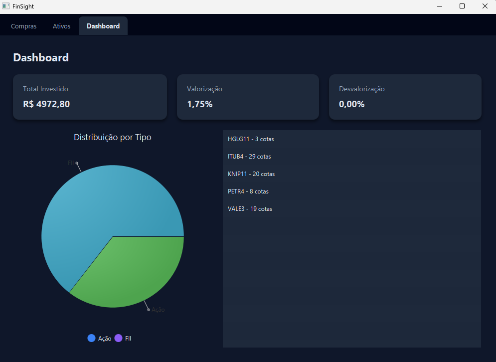
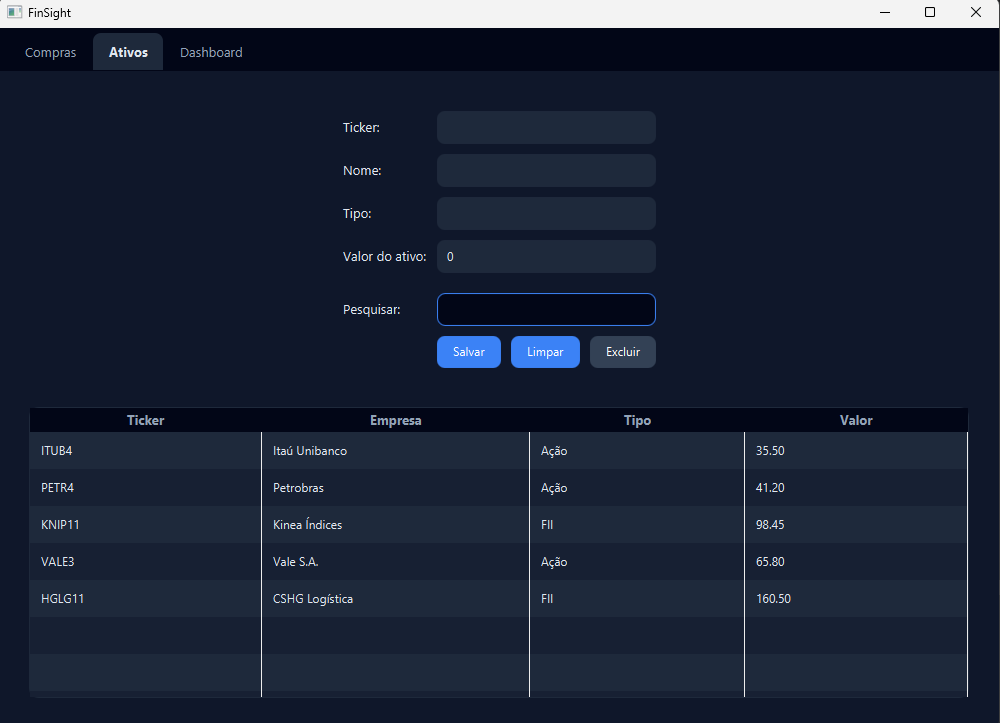
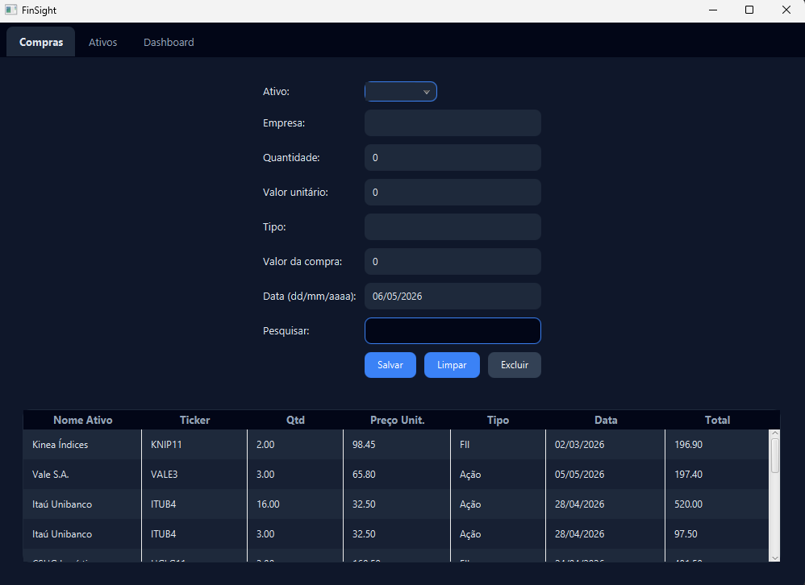

# 💰 FinSight | Gestão de Investimentos

Aplicação desktop desenvolvida em JavaFX para controle de ativos financeiros e registro de operações de compra, com foco em **arquitetura limpa, integridade de dados e rastreabilidade**.

---

## 📌 Sobre o Projeto

O **FinSight** foi desenvolvido como um desafio técnico com o objetivo de consolidar conhecimentos em:

- Integração entre **Java (JavaFX)** e **SQL (MariaDB)**
- Aplicação de padrões de arquitetura (**MVC e DAO**)
- Garantia de **integridade referencial e consistência dos dados**

A aplicação permite gerenciar uma carteira de investimentos (como ações e FIIs), mantendo um histórico completo de operações e um sistema de **auditoria automática via banco de dados**.

---

## 📸 Demonstração

### Dashboard


### Ativos


### Compras


🎥 **Vídeo de demonstração:**  
👉 [Assista ao funcionamento do sistema](./assets/demo.mp4)

---

## 🛠️ Tecnologias Utilizadas

- **Java 17**
- **JavaFX** (com CSS customizado e Dark Mode)
- **MariaDB / MySQL**
- **JDBC**
- **Git & GitHub**

---

## ✨ Funcionalidades

- ✔ CRUD completo de ativos (ticker, nome, tipo)
- ✔ Registro e gerenciamento de compras
- ✔ Validação de dados (valores inválidos, datas futuras, etc)
- ✔ Dashboard com resumo financeiro
- ✔ Interface moderna em Dark Mode
- ✔ Busca dinâmica de dados

### 🧠 Diferenciais técnicos

- Uso de **Triggers** para automação de regras no banco
- Implementação de **Procedures** para centralização de lógica SQL
- Utilização de **Cursores** para processamento de dados
- Sistema de **log de auditoria** para rastreamento de alterações

---

## 🗄️ Banco de Dados

O sistema utiliza recursos avançados do MariaDB para garantir robustez:

- **Chaves estrangeiras (FK)** para integridade referencial  
- **Triggers** para auditoria automática  
- **Tabela de logs (audit_log)** registrando inserções e atualizações  
- **Procedures e cursores** para operações mais complexas  

---

## 📁 Estrutura do Projeto
FinSight/
├── src/
│ ├── controller/ # Regras de negócio
│ ├── dao/ # Acesso a dados (JDBC)
│ ├── model/ # Entidades e validações
│ └── view/ # Interface JavaFX
├── resources/
│ ├── config/ # Configuração do banco (.properties)
│ └── css/ # Estilos da interface
├── sql/ # Scripts do banco de dados
└── README.md

---

## 🚀 Como Executar

### Pré-requisitos

- Java JDK 17 ou superior  
- MariaDB ou MySQL instalado  

### Passo a passo

1. Clone o repositório:

```bash
git clone https://github.com/AmadeusBertoline/FinSight.git
````
Configure o banco de dados executando os scripts da pasta:

/sql

Crie o arquivo de configuração:

resources/config/db.properties

Adicione suas credenciais:

db.url=jdbc:mariadb://localhost:3306/db_investimentos
db.user=seu_usuario
db.password=sua_senha

Execute a aplicação pela sua IDE
🔒 Segurança e Boas Práticas
🔐 Credenciais protegidas via .properties (não versionado)
🧱 Integridade garantida com constraints e FKs
📜 Auditoria completa via triggers e tabela de logs
🧠 Separação clara de responsabilidades (MVC)

👨‍💻 Autor

Amadeus Bertoline da Silva

📌 Projeto desenvolvido com foco em evolução prática em Java, banco de dados e arquitetura de software
